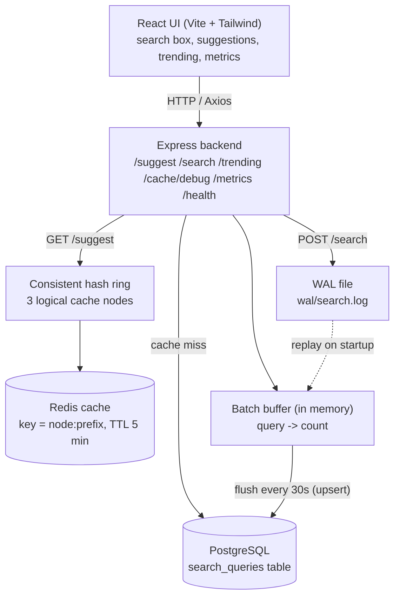

# Architecture

This document explains how the Search Typeahead System is put together and how a
request moves through it.

## High-level diagram



## Pieces

- **Frontend** – React app built with Vite, styled with Tailwind. Talks to the backend
  through a small Axios client. In development Vite proxies `/api` to the backend.
- **Backend** – Express server. Holds all the logic: suggestions, search recording,
  trending, cache routing, batch flushing, WAL, and metrics.
- **PostgreSQL** – the source of truth. One table, `search_queries (query, count, last_searched)`,
  with a prefix index so `LIKE 'abc%'` is fast.
- **Redis** – the cache. Suggestion results are stored here so repeated prefixes don't hit
  the database.
- **Consistent hash ring** – decides which of the three logical cache nodes owns a prefix.
  The node name becomes part of the Redis key.
- **Batch buffer** – an in-memory map that collects search counts so we don't write to the
  database on every single search.
- **WAL** – an append-only log file that lets us rebuild the buffer if the server restarts.

## Request flow: `GET /suggest?q=goo`

```
type "goo"
   |
   v
hash "goo" on the ring  ->  cacheNode3
   |
   v
look up Redis key "cacheNode3:goo"
   |
   +-- HIT  -> return cached suggestions  (record cache hit)
   |
   +-- MISS -> record cache miss + DB read
               SELECT query FROM search_queries
               WHERE query LIKE 'goo%' ESCAPE '\'
               ORDER BY count DESC, query ASC LIMIT 10
               store result in Redis (TTL 5 min)
               return suggestions
```

## Cache flow

```
get(prefix, ranking)
   node    = getNode(prefix)          # consistent hashing
   key     = node:prefix  (or node:prefix#recency)
   value   = redis.get(key)
   if value -> hit
   else     -> miss

set(prefix, suggestions, ranking)
   redis.set(key, {suggestions, createdAt}, EX = 300s)
```

The two ranking modes (count vs recency) are stored under separate keys, so they never
overwrite each other. Expiry is handled by Redis itself through the TTL.

## Batch write flow

```
POST /search "iphone"
   |
   v
append "iphone" to wal/search.log        # durability first
   |
   v
buffer["iphone"] += 1                     # aggregate in memory
   |
   v
respond { "message": "Searched" }         # no DB write here

every 30 seconds (cron):
   copy + clear the buffer
   for each query: INSERT ... ON CONFLICT (query)
                   DO UPDATE SET count = count + delta
   truncate the WAL
```

So 100 searches for the same query become **one** database write.

## WAL recovery flow

```
on startup:
   read wal/search.log
   for each line -> buffer[line] += 1     # rebuild the buffer
   continue normally

if the process crashes before a flush:
   the searches are still in the WAL file
   on the next startup they are replayed into the buffer
   the next flush writes them to PostgreSQL
```

## Trending flow

```
GET /trending
   score = count * (1 + W / (hours_since_last_search + 1))     # W = 3
   SELECT ... FROM search_queries
   WHERE count >= 5                       # eligibility: skip one-off searches
   ORDER BY score DESC, query ASC
   LIMIT 10
```

A recently searched query gets a higher score, but the score is built on top of the real
count, so a query searched only once cannot jump to the top. The same score is also
available on `/suggest?ranking=recency`.
