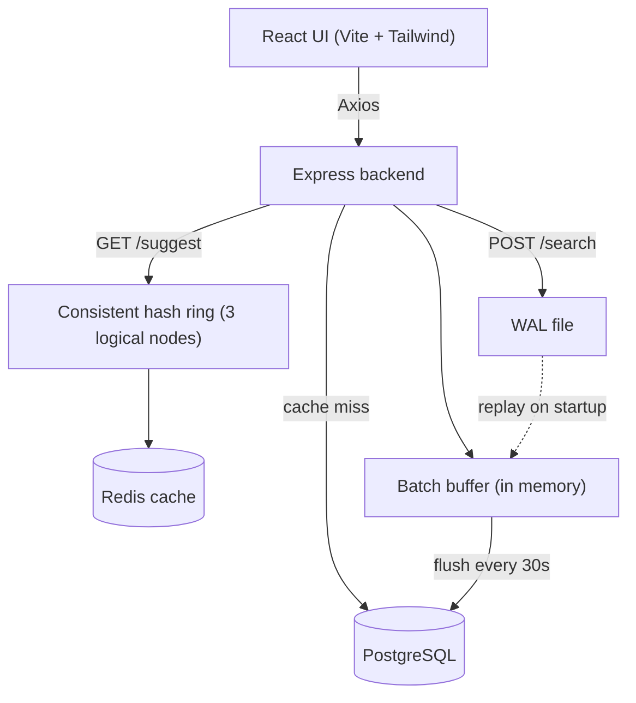

# Search Typeahead System — Project Report

**Project:** Search Typeahead System
**Student:** _[Your Name]_
**Course:** _[Course Name / Code]_
**Date:** _[Submission Date]_

---

## 1. Introduction

### Problem statement

Search boxes on large sites suggest queries as you type. Behind that simple feature is a
real systems problem: there can be a huge number of possible queries, suggestions need to
come back in a few milliseconds, and every search a user submits could update popularity
data. Doing a database write on every keystroke or every search does not scale.

This project builds a working typeahead system that handles those concerns: fast prefix
suggestions, a cache in front of the database, the cache split across nodes using consistent
hashing, recency-aware trending, and batched writes so the database isn't hammered.

### Goals

- Return up to 10 prefix suggestions, sorted by popularity, with low latency.
- Cache suggestions and serve from the cache before touching the database.
- Split the cache across multiple nodes and route prefixes with consistent hashing.
- Record searches without writing to the database on every request (batching).
- Keep buffered searches safe across a restart (WAL).
- Support a trending list that reacts to recent activity.
- Show all of this on a simple dashboard.

---

## 2. System Architecture



The backend is the centre of the system. On a read (`/suggest`) it hashes the prefix to a
cache node, checks Redis, and only queries PostgreSQL on a miss. On a write (`/search`) it
appends to the WAL, bumps an in-memory counter, and returns immediately; a scheduled job
flushes those counters to PostgreSQL every 30 seconds.

The database has a single table:

```sql
CREATE TABLE search_queries (
  id            SERIAL PRIMARY KEY,
  query         TEXT UNIQUE NOT NULL,
  count         BIGINT NOT NULL DEFAULT 0,
  last_searched TIMESTAMP NOT NULL DEFAULT NOW()
);
CREATE INDEX idx_search_queries_query_prefix
  ON search_queries (query text_pattern_ops);
```

The `text_pattern_ops` index is what makes `WHERE query LIKE 'abc%'` fast.

---

## 3. Dataset

**Source:** AOL search query dataset (real anonymized search logs), from Kaggle.

**Format of the raw data:** tab-separated files with columns
`AnonID, Query, QueryTime, ItemRank, ClickURL`. Each row is one search event, so the same
query appears many times and the files do not include a count.

**Loading and aggregation:** the `prepare:aol` script reads the raw file line by line,
counts how many times each distinct query appears, and keeps the top 150,000 queries by
count. This produces a `query,count` CSV. The `import` script then loads that CSV into
PostgreSQL in batches.

**Dataset statistics (file `user-ct-test-collection-02.txt`):**

| Metric | Value |
|---|---|
| Raw rows (search events) | 3,614,507 |
| Distinct queries after aggregation | 1,242,600 |
| Queries loaded (top by count) | 150,000 |
| Most frequent query | `google` (count 32,396) |
| Next few | `yahoo` (13,344), `ebay` (12,949), `mapquest` (8,680) |

The aggregation is genuine: counting `google` directly in the raw file gives 32,396, which
matches the count stored in the database.

---

## 4. API Documentation

| Method | Endpoint | Purpose |
|---|---|---|
| GET | `/suggest?q=&lt;prefix&gt;&ranking=&lt;count\|recency&gt;` | Up to 10 prefix suggestions |
| POST | `/search` | Record a search (returns a dummy response) |
| GET | `/trending` | Top 10 by recency-aware score |
| GET | `/cache/debug?prefix=&lt;prefix&gt;` | Which node owns a prefix and hit/miss |
| GET | `/metrics` | Cache, latency and write metrics |
| GET | `/health` | Liveness + DB check |

**GET /suggest** — `ranking` is optional and defaults to `count`.
```
GET /suggest?q=goo
{ "prefix": "goo", "ranking": "count",
  "suggestions": ["google", "google.com", "google earth"], "cached": false }
```

**POST /search**
```
POST /search   body: { "query": "google" }
{ "message": "Searched" }
```

**GET /trending**
```
{ "minCount": 5, "recencyWeight": 3,
  "trending": [ { "query": "google", "count": 32396, "hoursSinceLastSearch": 0.5, "score": 97188.0 } ] }
```

**GET /cache/debug**
```
GET /cache/debug?prefix=goo
{ "prefix": "goo", "node": "cacheNode3", "cacheHit": true, "ring": { ... }, "contents": { ... } }
```

**GET /metrics**
```
{ "cacheHits": 12, "cacheMisses": 4, "cacheHitRate": 75.0,
  "searchRequests": 40, "dbWrites": 6, "dbReads": 4, "writeReduction": 85.0,
  "suggestLatency": { "p50Ms": 1.05, "p95Ms": 2.04 } }
```

**GET /health**
```
{ "status": "ok", "dbConnected": true, "uptimeSeconds": 123 }
```

---

## 5. Core Design Decisions

### Caching
Suggestions are cached in Redis with a 5-minute TTL. A read checks the cache first and only
falls back to PostgreSQL on a miss, after which the result is written back to Redis. If
Redis is unavailable, the system still works — it just serves everything from the database.

### Consistent hashing
Three logical cache nodes sit on a hash ring. Each node is placed at 50 points on the ring
(virtual nodes) using an FNV-1a hash. To find the owner of a prefix, the prefix is hashed
and the ring is walked clockwise to the first node point. This means adding or removing a
node only moves the keys near it, instead of remapping everything. The owning node becomes
part of the Redis key (e.g. `cacheNode3:goo`), so the partitioning is visible.

### Trending ranking
Each query stores `count` and `last_searched`. The score is:

```
score = count * (1 + W / (hours_since_last_search + 1))     // W = 3
```

Recency multiplies the count rather than being added on top, so popularity still anchors
the ranking. A freshly searched query is boosted up to 4× and decays back to its raw count
over time. A query must also have `count >= 5` to appear in the trending list, which keeps
one-off searches out. The same score is available on `/suggest?ranking=recency`.

### Batch writes
`POST /search` does not write to the database. It appends the query to the WAL, increments
an in-memory counter, and returns. A scheduled job runs every 30 seconds and upserts each
distinct query once (`count = count + delta`). This turns many searches of the same query
into a single write.

### WAL
Before a search touches the buffer it is appended to `wal/search.log`. On startup the log is
replayed into the buffer, so searches that were buffered but not yet flushed are not lost if
the process restarts. After a successful flush the log is cleared.

---

## 6. Design Trade-offs

**Advantages**
- Reads are fast because most prefixes are served from Redis.
- The database write load is much lower thanks to batching.
- Consistent hashing keeps cache ownership stable when nodes change.
- The WAL makes the in-memory buffer safe across restarts.

**Limitations**
- Batching delays durability: a search reaches the database only at the next flush.
- The three cache nodes are simulated inside one Redis instance.
- Trending favors queries that already have some count, so a truly new query takes a few
  searches to surface.
- Imported rows are given a recent `last_searched` so trending has variety; the original
  2006 timestamps from the dataset are not used.

**Why these choices**
The assignment asks for something that is easy to explain and runs locally, so each part is
kept as simple as possible while still being the real technique (a real hash ring, a real
cache, a real append-only log). The trade-offs above are the cost of that simplicity.

---

## 7. Performance Report

Measured locally with the 150,000-row dataset, backend + PostgreSQL + Redis all on one
machine. Reproduce with `npm run benchmark`.

| Metric | Result |
|---|---|
| Dataset size | 150,000 queries |
| Suggest latency (server p50) | ~1.0 ms |
| Suggest latency (server **p95**) | ~2.0 ms |
| Suggest latency (client p95, under concurrency) | ~10 ms |
| Throughput | ~5,500 req/s |
| Cache hit rate (mixed run) | ~93% |
| Batch test | 100 searches → **1** DB write, count = 100 |

Latency is measured from real request timings (last 1000 `/suggest` requests) and exposed at
`/metrics`. The cache hit rate and write counts are live counters, not estimates.

---

## 8. Testing

Testing was done manually with `curl`, the dashboard, and direct SQL/Redis inspection.

**Functional**
- Prefix returns at most 10 results, all starting with the prefix, sorted correctly.
- Empty input, missing parameter, and no-match prefixes return an empty list.
- Mixed-case input works (input is lowercased and data is stored lowercase).
- `POST /search` with an empty body returns HTTP 400.

**Cache**
- First request for a prefix is a miss and creates a Redis key; the second is a hit.
- The key has a 5-minute TTL; a short-TTL test key expired as expected.

**Consistent hashing**
- The same prefix always maps to the same node.
- A spread of prefixes is distributed across all three nodes.

**Batch writes**
- 100 searches for one query produced one database write and a final count of 100.

**Failure scenario (WAL)**
- After sending searches and killing the process with `kill -9` before a flush, the searches
  were still in the WAL file and the database had none of them. On restart they were replayed
  and the next flush wrote them. No searches were lost.

**Edge cases**
- A literal `%` or `_` in the query is escaped so it is matched as a normal character, not a
  SQL wildcard.
- Sorting has a `query ASC` tie-breaker so results with equal counts come back in a stable
  order.

---

## 9. Conclusion

The system meets the goals it set out to: it serves fast prefix suggestions from a cache,
splits that cache across nodes with consistent hashing, records searches through a batched
write path backed by a WAL, and ranks trending queries with a recency-aware score. It runs
locally with PostgreSQL and Redis and uses a real search-query dataset.

The main areas it could improve are running the cache nodes as separate instances, closing a
small race in the WAL flush, and adding automated tests. None of these affect the core
behaviour, but they would make it closer to something you could run in production.
